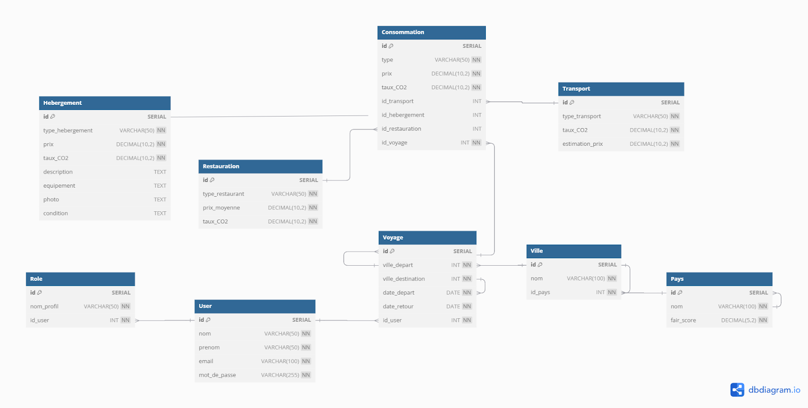

Cahier des Spécifications du Projet DEVOPS - V0.2

== Titre du Projet : Economad

Abréviation : ECON

Logo :

Membres de l'Équipe :

Timofte Alexandra Béatrice

* 
* Guemmat Manel
* Arafat Moustapha

Date :

20/12/2024

M1 MIAGE APP

= Partie 1 : Présentation

== Contexte

Le développement durable est devenu un enjeu majeur dans toutes les sphères de la
société, y compris dans le secteur du tourisme et des voyages. Les jeunes voyageurs,
soucieux de leur empreinte écologique, cherchent à concilier leur soif de découverte avec
une démarche responsable et économique. Dans ce contexte, la nécessité d’une plateforme
dédiée, permettant de comparer les moyens de transport selon leur impact environnemental
et leur coût, se fait sentir.

Economad s’inscrit dans cette dynamique en tant qu’application web innovante, pensée pour
répondre à ces besoins spécifiques. Elle vise à offrir des solutions pratiques et
personnalisées pour voyager tout en prenant conscience de l’impact carbone de chaque
décision, que ce soit pour le transport, l’hébergement ou les activités sur place.

== Problématique

Les plateformes existantes, telles que Booking, Google Flights ou Rome2Rio, offrent des
outils puissants mais fragmentés, souvent centrés sur les prix ou la rapidité sans inclure de
manière significative les critères environnementaux. De plus, l’absence d’un suivi
personnalisé de l’empreinte carbone rend difficile pour les utilisateurs de mesurer
concrètement leur impact écologique lors de leurs déplacements ou séjours.

Par ailleurs, la diversité des options de transport, d’activités et d’hébergement complique la
tâche des voyageurs désireux d’optimiser à la fois leur budget et leur impact écologique. Il
n’existe actuellement aucune application qui centralise ces aspects tout en intégrant des
données écologiques pertinentes et accessibles.

Gains Attendus

Economad répond à cette problématique en offrant des fonctionnalités intégrées et
innovantes, parmi lesquelles :

* Une analyse comparative écologique et économique des moyens de transport

(avion, train, covoiturage, etc.).

* Un tableau de bord personnalisé permettant de suivre l’empreinte carbone des

activités réalisées pendant un voyage (restaurants, visites, déplacements).

* Une interface intuitive qui simplifie la recherche de voyages en temps réel tout en
offrant des recommandations adaptées aux préférences et budgets des utilisateurs.

L’application permettra ainsi aux jeunes actifs, étudiants et professionnels éco responsables
de :

* Prendre des décisions éclairées en matière de transport et d’activités.
* Mesurer et réduire leur impact environnemental.
* Réaliser des économies tout en bénéficiant d’une expérience de voyage

enrichissante et fluide.

== Motivations de l’Équipe

Notre équipe est motivée par l’opportunité de créer une application qui allie innovation
technologique et impact sociétal positif. Nous souhaitons répondre à la demande croissante
pour des outils permettant de voyager de manière durable tout en exploitant les meilleures
pratiques du développement web et de l’approche DEVOPS.

Ce projet nous permet également d’explorer des technologies modernes (API REST,
intégration continue) dans un cadre réaliste, tout en mettant à l’épreuve nos compétences
en gestion de projet, conception d’interface et développement logiciel.

Concurrence / État de l’art de l’existant et Positionnement

Aujourd’hui, des plateformes bien établies comme Google Flights, Booking.com, ou
encore Rome2Rio dominent le marché, mais elles présentent des limitations :

* Google Flights : Excellente pour les comparaisons de vols, mais peu intégrée à
d'autres aspects du voyage (hébergements, activités) et sans prise en compte
écologique.

* Booking.com : Concentrée sur l’hébergement, sans critères écologiques ni

comparaison de transports.

* Rome2Rio : Offre une vue d’ensemble des itinéraires mais reste limitée en termes

d’interactions personnalisées et d’analyse écologique.

Economad se différencie en combinant :

* Une centralisation des données pour les transports, hébergements et activités.
* Une approche écologique, avec calculs d’impact carbone pour chaque option de

transport ou activité.

* Une personnalisation accrue, basée sur les préférences des utilisateurs en termes

de coût et de durabilité.

Persona et Fonctionnalités (Point de Vue Utilisateur)

Persona 1 : Léa, étudiante voyageuse écoresponsable

== Contexte
Léa, 22 ans, est une étudiante en urbanisme passionnée par l’écologie et la découverte de
nouvelles cultures. Avec un budget serré, elle cherche des moyens de voyager de manière
responsable tout en économisant sur les coûts de transport et d’hébergement. Elle aime
planifier ses voyages en détail, mais elle manque souvent de temps pour effectuer des
recherches approfondies sur les options disponibles.

Buts et comportements

* Léa souhaite comparer les options de transport (train, avion, bus) pour minimiser son

empreinte carbone tout en respectant son budget.

* Elle veut enregistrer ses trajets et suivre l’impact CO₂ de ses voyages pour

sensibiliser ses amis sur les réseaux sociaux.

* Elle apprécie les notifications en temps réel pour les offres spéciales correspondant

à ses critères.

Fonctionnalités attendues

1. Comparateur écologique et économique : Affiche l’impact CO₂ et le coût des

    différents moyens de transport pour une destination donnée.

2. Suivi personnalisé : Tableau de bord retraçant l’historique des trajets, des

    économies réalisées, et de l’empreinte carbone.

3. Notifications en temps réel : Alertes pour les promotions sur les trajets ou activités

   écologiques.

    Persona 2 : Max, jeune professionnel en quête de sens

    == Contexte
    Max, 28 ans, est un consultant en marketing basé à Paris. Il voyage souvent pour des
    raisons professionnelles et personnelles, mais il s’inquiète de l’impact environnemental de
    ses déplacements fréquents. Max souhaite un outil simple pour intégrer des choix durables
    à son quotidien sans sacrifier le confort ou la commodité.

    Buts et comportements

    * Max cherche à optimiser ses déplacements professionnels pour réduire son

    empreinte écologique.

    * Lors de ses vacances, il veut suivre l’impact CO₂ de ses activités quotidiennes,

    comme ses repas au restaurant ou ses déplacements locaux.

    * Il est intéressé par des recommandations d’activités écologiques et locales.

    Fonctionnalités attendues

1. Calculateur d’activités : Évalue l’impact CO₂ des activités locales, comme les

    restaurants ou les transports en commun.

2. Recommandations d’activités écologiques : Propose des visites, hébergements

    et restaurants responsables à proximité de ses destinations.

3. Export des données : Génération de rapports sur son impact carbone global à

    partager avec ses collègues ou ses amis.

    Persona 3 : Camille et Jules, famille voyageuse et curieuse

    == Contexte
    Camille et Jules, un couple de trentenaires, adorent voyager avec leurs deux jeunes enfants.
    Ils souhaitent transmettre à leurs enfants des valeurs écologiques tout en découvrant des
    cultures variées. Ils sont particulièrement attirés par les road trips, mais ils veulent réduire
    leur consommation de carburant et privilégier les options plus durables.

    Buts et comportements

    * Camille et Jules veulent planifier des voyages qui incluent des étapes adaptées aux

    familles (hébergements confortables, activités pour enfants).

    * Ils veulent comparer l’empreinte carbone de leurs trajets en voiture avec celle des

    transports publics.

    * Ils apprécient une interface simple et rapide pour accéder à des informations fiables.

    Fonctionnalités attendues

1. Optimisation des trajets en famille : Calcul des itinéraires les plus durables pour

    les road trips, incluant des arrêts écologiques et économiques.

2. Planificateur multi-étapes : Génération d’un itinéraire intégrant hébergements,

    activités familiales et trajets optimaux.

3. Mode hors ligne : Permet l’accès à leurs données de voyage et impact carbone

    même sans connexion Internet.

Résumé des Fonctionnalités Transversales

* Comparateur écologique et économique pour les transports.
* Suivi et tableau de bord CO₂ pour voyages et activités.
* Recommandations personnalisées adaptées aux profils des utilisateurs.
* Notifications et alertes pour les promotions et les offres écologiques.
* Planificateur d’itinéraires optimisés adapté à chaque besoin utilisateur.

Prévisions Marketing : Stratégies Innovantes

Pour promouvoir efficacement notre application web, nous devons adopter une approche
marketing novatrice qui capte l'attention de notre cible tout en renforçant l'image écologique,
économique et interactive de notre plateforme. Voici des idées stratégiques et créatives pour
maximiser l'impact :

1. Campagnes dynamiques sur les réseaux sociaux

* Plateformes ciblées :

○ Instagram, TikTok et Pinterest pour atteindre les jeunes voyageurs à travers

des contenus visuels immersifs.

○ LinkedIn pour cibler des professionnels cherchant des solutions de voyage

éco responsables pour le travail.

* Idées créatives :

○ Challenge TikTok : Créer un challenge où les utilisateurs partagent leurs

itinéraires de voyage bas carbone avec le hashtag #TravelGreenChallenge.

○ Mini-séries sur Instagram Réels : Des vidéos courtes illustrant comment

planifier un voyage écologique et économique en utilisant notre application.

2. Sensibilisation dans les lieux stratégiques

* Flyers intelligents :

○ Distribués dans les gares, universités et espaces de coworking.
○ Inclure un QR code qui simule rapidement l’empreinte carbone d’un trajet

pour inciter au téléchargement.

3. Partenariats engageants

* Agences de voyages éco responsables : Offrir une visibilité croisée en intégrant

notre plateforme à leurs services.

* Associations écologiques : Collaborations pour des campagnes de sensibilisation

au voyage durable, avec des ateliers ou webinars gratuits.

* Influenceurs “green travel” : Travailler avec des créateurs de contenu spécialisés

dans le voyage éco responsable pour promouvoir l’application.

4. Communication transparente sur les impacts

* Storytelling écoresponsable :

○ Des articles de blog ou des newsletters racontant les histoires des utilisateurs

ayant réduit leur empreinte carbone grâce à notre application.

* Statistiques visuelles :

○ Infographies sur le CO₂ économisé par les utilisateurs de l’application au fil du

temps.

* Impact collectif : Affichage en temps réel du total de CO₂ économisé grâce aux

trajets planifiés via l’application.

= Partie 2 : Aspects Techniques

Type d'Application : Application web API REST.

Architecture :

* Frontend : Vue.js pour une interface fluide.
* Backend : Spring Boot pour l'API REST.
* Base de données : MySQL pour stocker les trajets, les critères utilisateur, et les

données CO₂.

Technologies Utilisées :

* Langage : Java avec Gradle (Backend), JavaScript & CSS & HTML (Frontend).
* CI/CD : GitHub Actions pour l'intégration continue.
* Tests : JUnit pour les tests unitaires, Postman pour l'API REST.

Plateforme Opérationnelle :

* Outils de gestion : GitHub (versioning & Kanban).
* Environnement de développement : VSCode (pour le backend, ainsi que le

frontend)

Interconnexion avec API externes :

Prévisionnelle, on souhaitera l’implémenter en Master2.

* API pour le calcul des émissions CO₂ (par ex. SNCF).
* API pour récupérer les données des transports (Skyscanner, Rome2Rio, Booking).

Schéma architecturale de l’application (front/ API REST / back / BDD ) :

= Partie 3 : Modélisation

Grande Feature 1 : Comparateur des moyens de transport avec impact CO₂

* Fonctionnalité : Permet de comparer les émissions et coûts des trajets pour une

destination donnée.

* Backend :

○ Modèle de données pour les trajets et les modes de transport.
○ Endpoint REST pour calculer les comparaisons.

* Frontend :

○ Interface de saisie des critères (budget, distance, moyens de transport).
○ Affichage des résultats sous forme de tableau interactif.

Grande Feature 2 : Suivi de la consommation CO₂ (activités touristiques)

* Fonctionnalité : Tableau de bord pour suivre l’impact CO₂ d’activités comme les

restaurants ou visites.

* Backend :

○ Base de données pour stocker les consommations unitaires des activités.
○ API REST pour enregistrer et récupérer les données utilisateur.

* Frontend :

○ Interface utilisateur pour saisir les activités.
○ Visualisation graphique des consommations.

Version 0.2 - Économad

Dans cette première version (0.2), nous avons ajouté deux grandes fonctionnalité.

Première grande fonctionnalité : Comparateur de modes de transport

Une fonctionnalité qui permet à l’utilisateur de comparer différents moyens de transport
(train, bus, voiture, avion) en fonction de critères comme :

* Le coût (affiché pour chaque option).
* Les émissions de CO2 générées pour le trajet sélectionné.
* Le temps de trajet estimé.

Cela aide l'utilisateur à faire un choix plus écologique et économique en un coup d’œil.

Deuxième grande fonctionnalité : Historique des trajets et émissions

Nous avons ajouté un historique des trajets réalisés, permettant à l'utilisateur de :

* Voir ses anciens voyages avec les modes de transport choisis.
* Consulter les émissions totales de CO2 économisées.
* Enregistrer les trajets fréquents pour les réutiliser facilement lors des prochaines

recherches.

Diagramme de l’organisation de la base des données :
